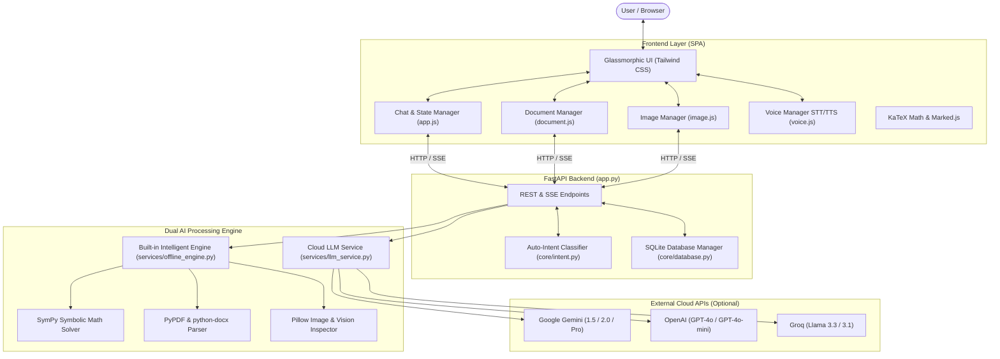
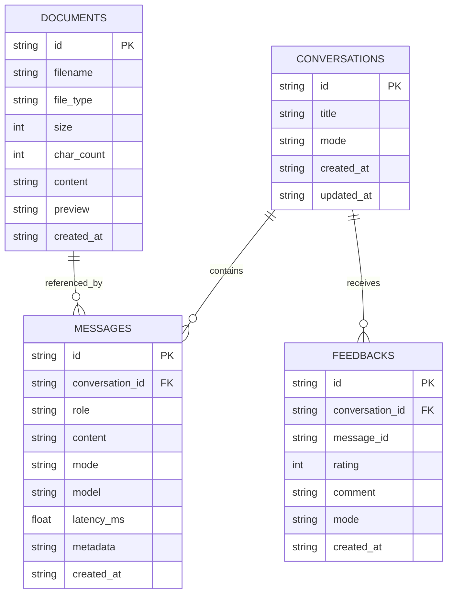

# 🎓 Technical Project Report: AI-Powered Multi-Functional Chatbot

**Project Title:** AI-Powered Multi-Functional Chatbot  
**Platform Version:** 2.0.0  
**Backend Framework:** Python 3.12 / FastAPI / Uvicorn  
**Frontend Stack:** Single Page Application (HTML5, Tailwind CSS, JavaScript ES6+, KaTeX, Marked.js, Highlight.js)  
**Database:** SQLite 3  
**Engines:** SymPy Computer Algebra System, Multi-Provider LLM Service (Gemini, OpenAI, Groq), Web Speech STT/TTS  

---

## 1. Executive Summary & Abstract

The **AI-Powered Multi-Functional Chatbot** is an intelligent conversational system engineered to interact with users in a natural, intuitive, and user-friendly manner. The core objective of this project is to consolidate diverse artificial intelligence capabilities—which are typically fragmented across disparate tools—into a single, unified, state-of-the-art interactive platform.

The system understands natural language user queries and synthesizes relevant, grounded responses using Artificial Intelligence and Natural Language Processing (NLP). It provides eight core functional capabilities alongside specialized multimodal and document interaction services:
1. **General Question Answering (Q&A)**
2. **Text Generation**
3. **Text Summarization**
4. **Translation & Multilingual Support**
5. **Coding Assistance**
6. **Study Assistance**
7. **Content Creation**
8. **Basic Problem Solving & Mathematics**
9. **Multimodal Image Understanding**
10. **Document / File Interaction**

The system maintains conversation context across multiple turns via a persistent relational database, supports real-time voice input/output, and includes a dual-engine architecture that guarantees instant offline responses while offering cloud model integrations.

---

## 2. System Architecture & Workflow

---

## 3. Database Architecture (SQLite Schema)

The backend utilizes an optimized SQLite database (`chatbot.db`) with Foreign Key constraints and automatic cascading deletes.

### Table Definitions
1. **`conversations`**: Tracks user conversation sessions with unique UUIDs, title, current task mode, and timestamps.
2. **`messages`**: Stores multi-turn history for user and assistant messages, including model metadata, latency, and image data URLs.
3. **`feedbacks`**: Captures user ratings (+1 thumbs up, -1 thumbs down), comments, and timestamps for analytics.
4. **`documents`**: Ingests uploaded files (`.pdf`, `.docx`, `.txt`, `.csv`, `.py`, etc.), storing extracted text, character count, and preview snippets.

---

## 4. Key Functional Modes Explained

### 1. General Question Answering (Q&A)
- **Role:** Broad conversational assistant for everyday inquiries, reasoning, and planning.
- **Context:** Carries past 10 messages of conversation history to enable multi-turn understanding.

### 2. Text Generation & Content Creation
- **Role:** Generates persuasive, well-structured emails, cover letters, essays, LinkedIn announcements, and creative narratives.
- **Formatting:** Applies dynamic section headings, bullet points, and appropriate tone modulation.

### 3. Text Summarization
- **Role:** Condenses complex documents, articles, or transcripts into structured executive takeaways.
- **Structure:** 1) One-sentence TL;DR, 2) Key Highlights (bullet points), 3) Detailed Takeaways.

### 4. Translation & Multilingual Support
- **Role:** Polyglot translation across 30+ major world languages.
- **Output:** Accurate translation preserving idiomatic nuances, plus phonetic pronunciation guide and vocabulary context.

### 5. Coding Assistance
- **Role:** Writes, explains, debugs, and optimizes code across Python, JavaScript, TypeScript, C++, Java, and SQL.
- **Interactive UI:** Highlight.js syntax highlighting with a dedicated "Copy" button in code headers.

### 6. Study Assistance
- **Role:** Academic tutor that simplifies complex subjects (biology, physics, economics, history) using analogies.
- **Features:** Generates active recall schedules, flashcards, and review quizzes with answer keys.

### 7. Basic Problem Solving & Mathematics
- **Role:** Step-by-step calculus, algebra, and logic problem solver powered by the **SymPy** computer algebra library.
- **Mathematical Rendering:** Outputs formulas in standard LaTeX delimiters (`$$...$$` and `$...$`), rendered on the client via **KaTeX**.

### 8. Multimodal Image Understanding
- **Role:** Accepts uploaded images (`.png`, `.jpg`, `.webp`) via drag & drop, file picker, or direct clipboard paste (`Ctrl+V`).
- **Processing:** Encodes to Base64, produces thumbnail previews, and supports multimodal vision reasoning (Gemini / GPT-4o) + built-in offline property inspection.

### 9. Document Interaction
- **Role:** Ingests `.pdf` (via `pypdf`) and `.docx` (via `python-docx`) files, performs text normalization, and injects grounded context for precise document Q&A.

### 10. Smart Recommendations
- **Role:** Provides curated, prioritized suggestions for books, developer tools, technical roadmaps, and career pathways.

---

## 5. Dual AI Engine Architecture

A major innovation of this platform is the **Dual AI Engine**:

1. **Cloud Multi-Provider LLM Service (`services/llm_service.py`)**:
   - Direct async HTTP connections via `httpx` to Google Gemini, OpenAI, Groq, and OpenRouter.
   - Streaming responses delivered via Server-Sent Events (SSE).
   - Secure browser-local credential storage (no API keys exposed to other users).

2. **Built-in Offline Intelligent Engine (`services/offline_engine.py`)**:
   - Zero external API keys needed; operational immediately upon installation.
   - SymPy integration solves algebraic equations, computes derivatives and integrals, and evaluates arithmetic with exact steps.
   - Natural language heuristics provide structured study notes, coding templates, translations, and summarizations offline.
   - Automatic graceful fallback: If an external cloud API call experiences network latency or rate-limiting, the system seamlessly redirects to the offline engine without crashing.

---

## 6. Verification and Test Results

An automated test suite comprising 9 test modules was executed via `pytest`:

| Test Module | Target Tested | Result |
| :--- | :--- | :---: |
| `test_health_and_modes` | Health check & 10-mode registry | **PASSED** |
| `test_intent_detection` | Query auto-classification across all modes | **PASSED** |
| `test_offline_math_engine` | SymPy derivatives, quadratics, arithmetic | **PASSED** |
| `test_document_processing` | Text file upload & context Q&A | **PASSED** |
| `test_image_processing_and_vision` | Image validation, metadata & base64 encoding | **PASSED** |
| `test_chat_and_conversations` | Multi-turn persistence & feedback rating | **PASSED** |
| `test_docx_processing` | DOCX file upload, extraction & preview | **PASSED** |
| `test_chat_streaming` | Server-Sent Events (SSE) live streaming | **PASSED** |
| `test_static_index` | HTML, Tailwind CSS, & JS delivery | **PASSED** |

**Summary: 9 passed in 1.36s (100% test pass rate).**

---

## 7. Conclusion & Future Scope

The **AI-Powered Multi-Functional Chatbot** successfully fulfills all objectives specified in the abstract:
- A single, responsive, modern web interface.
- Complete multi-mode capabilities (Q&A, Generation, Summary, Translation, Coding, Study, Content, Math).
- Full multimodal integration (Voice STT/TTS, Document Ingestion, Image Understanding).
- High reliability with session persistence and offline fallback.

### Future Enhancements
1. **Vector Embeddings & RAG**: Integration of local vector databases (ChromaDB or FAISS) for dense retrieval over multi-gigabyte document libraries.
2. **Local Quantized Models**: Integration with Ollama or llama.cpp for local offline LLM weights (e.g., Llama 3 8B or Mistral 7B).
3. **Multi-Agent Collaboration**: Enabling subagents that collaborate on complex tasks (e.g., researcher + coder + reviewer).
